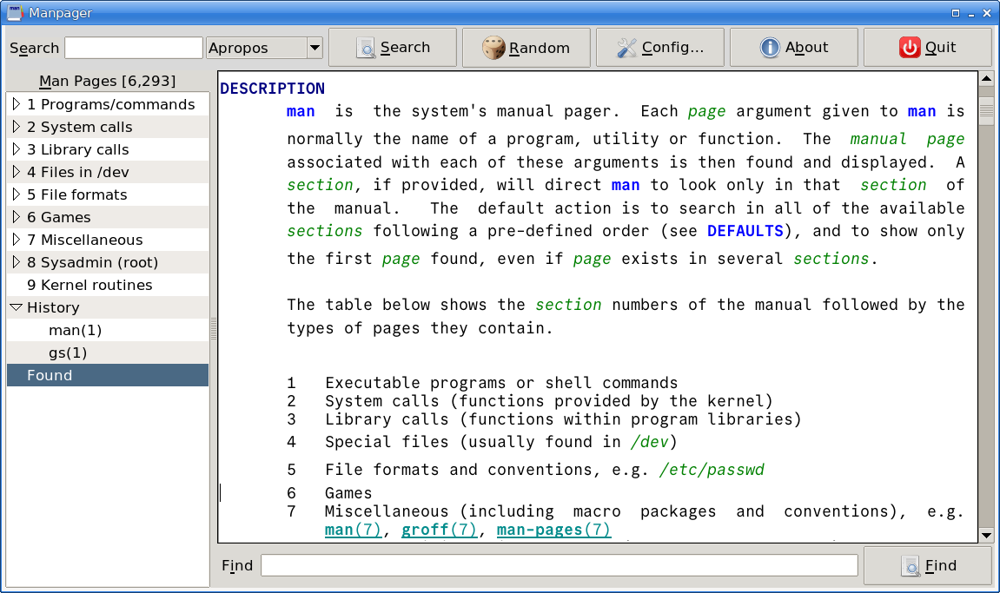

# Manpager

A GUI Unix man page view (an alternative to gman).

Manpager presents a browsable tree view of the system’s man pages.

It also supports apropos (keyword), full text, and man page name searches.

Man page links (e.g., `man(7)`) that appear in pages are clickable links
which change the display to the clicked man page. Similarly web links are
clickable (using showing pages in your web browser).

Note: I use [Store](https://github.com/mark-summerfield/store) for version
control so github is only used to make the code public.

## Dependencies

Tcl/Tk 9; Tcllib; Tklib; `man` executable.

## License

GPL-3

---
